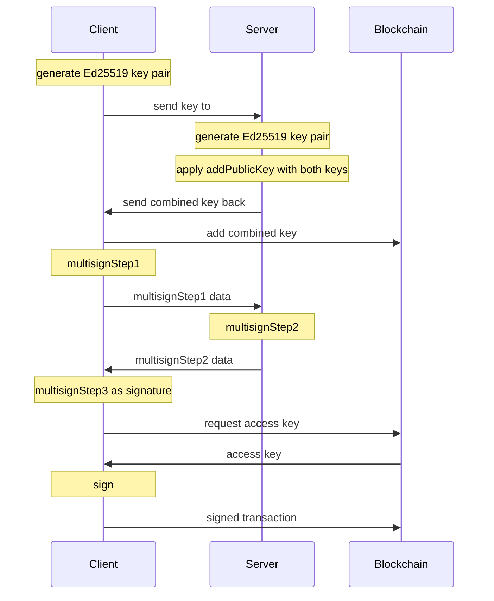

# Multisign

Two-party signature generation for Ed25519.
This code allows two parties (a "client" and a "server") to jointly generate
an Ed25519 signature under a key that neither one of them possesses in its entirety.
The process consists of two phases. During the setup phase,
the combined key is generated. During the signing phase, the signature is generated.

## Setup phase:
Both the client and the server generate a regular Ed25519 key pair.
The server may use the same key pair for all clients. Then,
they exchange their public keys and call **addPublicKeys** to compute the combined
public key. The combined public key is the key under which the signatures will validate.

## Signing phase:
This phase proceeds in three steps.
- The client calls multiSignStep1. This produces some data that needs to be
sent to the server, as well as a secret value that the client should keep locally.

- The server receives the data from the client and passes it
to multiSignStep2. This produces some data that needs to be sent to the client.

- The client calls multiSignStep3, passing the data from the server as well
as the local secret. This produces the signature.




See the comments above to specific methods for more details.

## Methods

```typescript
/**
 * Adds two public keys together, producing the combined key. The order of the keys does not matter.
 *
 * @param {Uint8Array} publicKey1 the first key
 * @param {Uint8Array} publicKey2 the second key
 *
 * @returns {Uint8Array | null} the combined key.
 * If the argument values are invalid, returns null or a meaningless value
 */
function addPublicKeys(
  publicKey1: Uint8Array,
  publicKey2: Uint8Array
): Uint8Array | null
```

```typescript
/**
 * Performs the first step of the two-party signature generation algorithm.
 * This step is performed by the client.
 *
 * @returns {{
 *   data: Uint8Array,
 *   secret: unknown,
 * }}
 *
 * the "data" to be sent to the server. This is always STEP1_DATA_LEN bytes long.
 * the "secret" is an opaque value that the client should keep. This data should be stored IN MEMORY ONLY and only used ONCE.
 */
function multiSignStep1(): { data: Uint8Array; secret: Secret }
```

```typescript
/**
 * Performs the second step of the two-party signature generation algorithm.
 * This step is performed by the server.
 *
 * @param {Uint8Array} step1data the data produced during step 1. Must be exactly STEP1_DATA_LEN bytes long.
 * @param {Uint8Array} msg the message to sign.
 * @param {Uint8Array} publicKey the combined public key (NOT the server's public key).
 * @param {Uint8Array} secretKey the server's secret key.
 *
 * @returns {Uint8Array|null} the data to be sent to the client. This is always STEP2_DATA_LEN bytes long.
 * If the argument values are invalid, returns null or a meaningless value.
 */
export function multiSignStep2(
  step1data: Uint8Array,
  msg: Uint8Array,
  publicKey: Uint8Array,
  secretKey: Uint8Array
): Uint8Array | null
```

```typescript
/**
 * Performs the third step of the two-party signature generation algorithm. This step is performed by the client.
 *
 * @param {Uint8Array} step2data the data produced during step 2. Must be exactly STEP2_DATA_LEN bytes long.
 * @param {unknown} secret the value produced during step 1. THIS VALUE MUST NOT BE USED MORE THAN ONCE.
 * @param {Uint8Array} msg the message to sign, must be the same as during step 2.
 * @param {Uint8Array} publicKey the combined public key (NOT the client's public key).
 * @param {Uint8Array} secretKey the client's secret key.
 *
 * @returns {Uint8Array|null} the signature.
 * If the argument values are invalid, returns null or a meaningless value
 */
export function multiSignStep3(
  step2data: Uint8Array,
  secret: Secret,
  msg: Uint8Array,
  publicKey: Uint8Array,
  secretKey: Uint8Array
): Uint8Array | null
```
